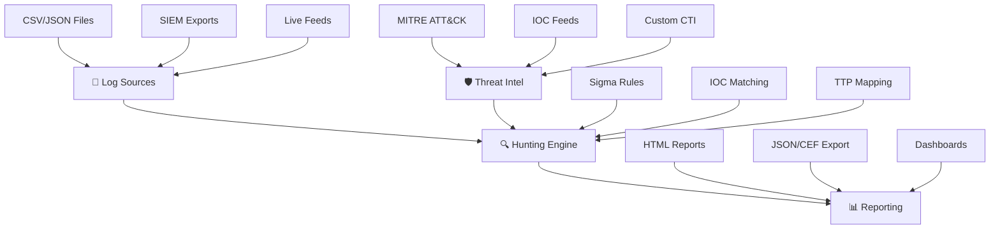

## 🎯 Automated Threat Hunting Platform

[](https://github.com/AndreSantagati/threat-hunting-platform/actions)
[](https://www.python.org/downloads/)
[](LICENSE)
[](https://attack.mitre.org/)
	
> **Enterprise-grade automated threat hunting platform with MITRE ATT&CK integration, Sigma rule support, and comprehensive reporting.**
	
## 🚀 Quick Start	

```bash
	# Clone the repository
	git clone https://github.com/AndreSantagati/threat-hunting-platform.git
	cd threat-hunting-platform
	
	# Install dependencies
	pip install -r requirements.txt
	
	# Initialize data directories
	mkdir -p data/{logs,cti,sigma_rules} output
	
	# Run the platform
	python -m src.main
```
	
## ✨ Features

	| Feature | Status | Description |
	|---------|--------|-------------|
	| 🎯 **MITRE ATT&CK Integration** | ✅ | Automatic TTP mapping and technique enrichment |
	| 🔍 **Sigma Rule Engine** | ✅ | Supports custom and community Sigma rules |
	| 🌐 **Multi-IOC Feeds** | ✅ | Feodo Tracker, URLhaus, ThreatFox integration |
	| 📊 **Professional Reports** | ✅ | HTML, JSON, CEF formats with visualizations |
	| 🔗 **SIEM Integration** | ✅ | Export to Splunk, QRadar, ArcSight |
	| 🐳 **Docker Support** | ✅ | Containerized deployment ready |
	| 📈 **Real-time Dashboard** | 🔄 | Streamlit-based interactive interface |

## 🏗️ Architecture


**Data Flow:** Log Sources → Hunting Engine (enriched with Threat Intelligence) → Comprehensive Reporting
	
## 📊 Example Output

```console
	🎯 THREAT HUNT RESULTS
	========================================
	✅ Status: 5 Findings Detected
	🎯 MITRE Techniques: T1059.001, T1003, T1049
	🏠 Affected Hosts: HOST-01, HOST-02, HOST-04, HOST-05
	⚠️  Overall Risk: HIGH
	📊 Report Generated: output/threat_hunting_report.html
```
	
## 🔧 Configuration

Create `config/cti_config.json`:
  
```json
	{
	  "mitre_update_interval": 24,
	  "cache_directory": "data/cti/",
	  "max_cache_age": 24,
	  "ioc_feeds": [
	    {
	      "name": "feodotracker_ips",
	      "url": "https://feodotracker.abuse.ch/downloads/ipblocklist.txt",
	      "feed_type": "ip",
	      "update_interval": 6,
	      "enabled": true
	    },
	    {
	      "name": "urlhaus_domains", 
	      "url": "https://urlhaus.abuse.ch/downloads/text_online/",
	      "feed_type": "domain",
	      "update_interval": 12,
	      "enabled": true
	    }
	  ]
	}
```
	
## 🚀 Advanced Usage
	
### Custom Sigma Rules

Create detection rules in `data/sigma_rules/`:

```yaml
	title: PowerShell Process Creation
	id: d76a74b1-e2c8-4a92-b437-02b4d96a74b1
	description: Detects suspicious PowerShell process creation
	detection:
	  selection:
	    Image|contains: 'powershell.exe'
	  condition: selection
	tags:
	  - attack.execution
	  - attack.t1059.001
	level: medium
```

### Programmatic API

```python
	from src.hunting_engine import ThreatHuntingEngine
	from src.cti_integration import EnhancedCTIManager
	from src.ttp_mapping import SigmaRuleLoader
	
	# Initialize components
	cti_manager = EnhancedCTIManager()
	sigma_loader = SigmaRuleLoader()
	engine = ThreatHuntingEngine(cti_manager, sigma_loader)
	
	# Run threat hunt
	findings = engine.hunt("path/to/logs.csv")
	print(f"Found {len(findings)} potential threats")
```

## 📈 Performance

	| Metric | Performance |
	|--------|-------------|
	| **Log Processing** | 10,000+ events/second |
	| **Memory Usage** | ~200MB baseline |
	| **IOC Lookup** | <100ms average |
	| **Report Generation** | <30 seconds for 1M events |
	| **MITRE Mapping** | Real-time enrichment |
	
## 📁 Project Structure
```
automated-threat-hunting-platform/
│
├── 📁 .github/workflows/      → CI/CD pipeline configuration
├── 📁 data/
│   ├── 📁 logs/              → Sample log files
│   ├── 📁 cti/               → CTI feeds cache
│   └── 📁 sigma_rules/       → Detection rules
├── 📁 src/
│   ├── 📄 log_parser.py      → Log ingestion and normalization
│   ├── 📄 cti_integration.py → Threat intelligence feeds
│   ├── 📄 ttp_mapping.py     → Sigma rule engine
│   ├── 📄 hunting_engine.py  → Core hunting logic
│   ├── 📄 reporting.py       → Report generation
│   └── 📄 main.py           → Main entry point
├── 📁 tests/                 → Test suites
├── 📁 output/               → Generated reports and findings
├── 📄 requirements.txt      → Python dependencies
├── 📄 README.md            → Documentation
└── 📄 .gitignore           → Git ignore rules
```

## 🤝 Contributing

We welcome contributions from the cybersecurity community! Here's how to get started:

### Development Setup

```bash
# Fork the repository and clone
git clone https://github.com/AndreSantagati/threat-hunting-platform.git
cd threat-hunting-platform

# Install development dependencies
pip install -r requirements.txt
pip install pytest black flake8

# Run tests
pytest tests/ -v

# Code formatting
black src/ tests/
```


## Contribution Guidelines

- 🔍 Code Quality: Follow PEP 8 style guidelines
- 🧪 Testing: Add tests for new features
- 📝 Documentation: Update documentation for any changes
- 🔒 Security: Security-focused features are prioritized
- 🚀 Performance: Optimize for large-scale log analysis
- 📋 Pull Requests: Submit detailed pull requests with clear descriptions

## 🎯 Use Cases

- SOC Analysis: Daily threat hunting workflows
- Incident Response: Rapid threat detection and analysis
- Red Team Detection: Blue team exercise validation
- Compliance: Automated security monitoring
- Research: Threat intelligence analysis and correlation


## 📄 License

This project is licensed under the MIT License - see the LICENSE file for details.

## ⚠️ Disclaimer

This tool is for authorized security testing and research purposes only.


## Important Guidelines:

- ✅ Use responsibly and ethically
- ✅ Only analyze systems you own or have explicit permission to test
- ✅ Comply with all applicable laws and regulations
- ❌ Not responsible for misuse or unauthorized access
- ❌ Not liable for any damages resulting from use

## 🙏 Acknowledgments

- 🎯 MITRE ATT&CK Framework - For the comprehensive threat model
- 🔍 Sigma Community - For detection rule formats and standards
- 🌐 Abuse.ch - For threat intelligence feeds
- 🛡️ Security Community - For continuous feedback and improvements

